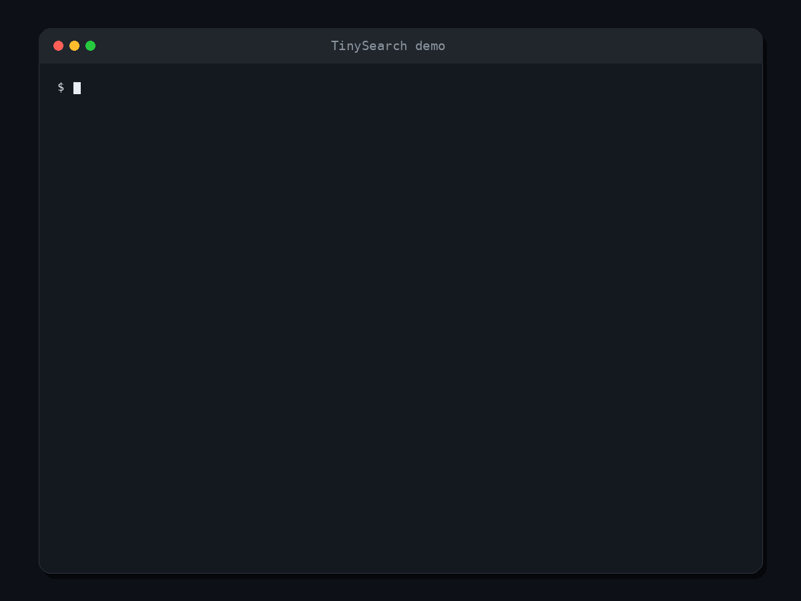
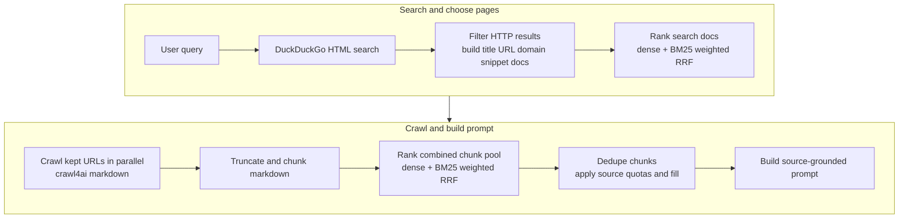

# TinySearch

<p align="center">
  
</p>

[](LICENSE)
[](https://github.com/MarcellM01/TinySearch/releases)
[](https://github.com/MarcellM01/TinySearch/commits/main)
[](https://modelcontextprotocol.io/)
[](https://fastapi.tiangolo.com/)

A tiny local-first web research engine for MCP agents.

TinySearch searches the web, reranks results, crawls the best pages, extracts
the most relevant chunks, and returns a source-grounded prompt your LLM can
answer from.

<p align="center">
  
</p>

No hosted dashboard. No account system. No analytics. No scraped-data cache.

Just search -> crawl -> rerank -> grounded prompt.

## Quick start

Run TinySearch as an MCP server over Streamable HTTP:

```bash
docker run --rm -p 8000:8000 -e MCP_TRANSPORT=streamable-http -e MCP_HOST=0.0.0.0 marcellm01/tinysearch:latest
```

Then connect your MCP client to:

```json
{
  "mcpServers": {
    "tinysearch": {
      "url": "http://localhost:8000/mcp"
    }
  }
}
```

TinySearch exposes one MCP tool:

```text
research(query)
```

Pass the user's question as-is. TinySearch searches, crawls, reranks, and
returns the grounded prompt in `answer`.

## Why TinySearch?

- Give local agents web research without wiring together a whole search stack.
- Keep source URLs attached to the evidence your model sees.
- Avoid dumping full webpages into context.
- Use local ONNX embeddings or an OpenAI-compatible embedding API.
- Run over MCP or a simple FastAPI endpoint.

TinySearch is built for local agents, prototypes, personal workflows, and small
systems where source-grounded web research matters more than running a full
search backend.

## How it works



TinySearch does not directly answer the question. It returns a
**structured prompt** in the MCP tool's **`answer` field**, and your
**client model** uses that prompt to produce the final **cited response**.

```text
QUESTION
What happened in the latest NFL playoffs?

TODAY
2026-05-15

RESULTS
1. Title
   URL
   Relevant extracted text...

2. Title
   URL
   Relevant extracted text...

INSTRUCTIONS
Answer only from the results. Cite source URLs.
```

## Run from source

Use this path if you want to inspect the code, edit TinySearch, or run it as a
local stdio MCP server.

```bash
git clone https://github.com/MarcellM01/TinySearch
cd TinySearch

python -m venv .venv
source .venv/bin/activate
pip install -r requirements.txt
```

MCP clients spawn TinySearch from their config. Add it with absolute paths:

macOS / Linux:

```json
{
  "mcpServers": {
    "tinysearch": {
      "command": "/absolute/path/to/TinySearch/.venv/bin/python",
      "args": [
        "/absolute/path/to/TinySearch/servers/mcp_server.py"
      ]
    }
  }
}
```

Windows:

```json
{
  "mcpServers": {
    "tinysearch": {
      "command": "C:/absolute/path/to/TinySearch/.venv/Scripts/python.exe",
      "args": [
        "C:/absolute/path/to/TinySearch/servers/mcp_server.py"
      ]
    }
  }
}
```

Template config files live in `mcp_templates/`.

The repo also includes [`agentic_coding_templates/global-rules-recommended.md`](agentic_coding_templates/global-rules-recommended.md),
a global-rules template for agentic coding tools such as Cline and Roo Code.
These rules help coding agents call TinySearch only when web research is
actually needed.

The server uses **stdio** by default, which is what Cursor and similar clients
expect when they spawn `python .../mcp_server.py`. To run with `sse` or
`streamable-http`, set `MCP_TRANSPORT` when starting the process. Do not put
transport in `configs/research_config.json`.

## Docker

The [quick start](#quick-start) command runs TinySearch over Streamable HTTP on
`http://localhost:8000/mcp`. Docker pulls `marcellm01/tinysearch:latest`
automatically if the image is not already local.

With `MCP_TRANSPORT=streamable-http`, the image serves Streamable HTTP on
`/mcp` and SSE on `/mcp/sse`. GET requests to `/mcp` without an
`mcp-session-id` are treated as the legacy SSE stream. If a client still cannot
connect, try `MCP_TRANSPORT=sse` alone or the stdio Docker setup below.

### Persistent models and config

For repeated use, keep downloaded models in a Docker volume and mount your local
config:

```bash
docker run --rm \
  -p 8000:8000 \
  -v tinysearch-models:/data/models \
  -v "$PWD/configs/research_config.json:/config/research_config.json:ro" \
  -e TINYSEARCH_CONFIG_PATH=/config/research_config.json \
  -e MCP_TRANSPORT=streamable-http \
  -e MCP_HOST=0.0.0.0 \
  marcellm01/tinysearch:latest
```

### MCP over stdio

Use this mode for MCP clients that launch tools as local commands instead of
connecting to a URL. Replace `/absolute/path/to/TinySearch` with this repo's
absolute path:

```json
{
  "mcpServers": {
    "tinysearch": {
      "command": "docker",
      "args": [
        "run",
        "--rm",
        "-i",
        "-v",
        "tinysearch-models:/data/models",
        "-v",
        "/absolute/path/to/TinySearch/configs/research_config.json:/config/research_config.json:ro",
        "-e",
        "TINYSEARCH_CONFIG_PATH=/config/research_config.json",
        "-e",
        "TINYSEARCH_MODELS_DIR=/data/models",
        "marcellm01/tinysearch:latest"
      ]
    }
  }
}
```

Edit `configs/research_config.json` to choose `embedding_model` (`fast`,
`balanced`, `quality`, or a custom Hugging Face ONNX repo id). The named Docker
volume keeps downloaded model bundles between launches.

## Optional HTTP server

Useful when you want HTTP instead of MCP:

```bash
uvicorn servers.fastapi_server:app --reload
```

Endpoints:

- `GET /health`
- `GET /web_search?query=...`
- `POST /site_crawl`
- `POST /research`

## Configuration

Tune research defaults in `configs/research_config.json`. Set
`TINYSEARCH_CONFIG_PATH` to load a different JSON config file, which is the
recommended Docker override pattern.

The `onnx` embedding backend uses local ONNX bundles under `models/`. Starting
the MCP server or FastAPI app downloads the configured `embedding_model` once
from Hugging Face when `embedding_backend` is `onnx`.

Built-in local presets:

- `fast`: `onnx-models/all-MiniLM-L6-v2-onnx`
- `balanced`: `BAAI/bge-small-en-v1.5`
- `quality`: `BAAI/bge-base-en-v1.5`

You can also set `embedding_model` to a custom Hugging Face ONNX repo id. Set
`TINYSEARCH_MODELS_DIR` to move the model cache, or use
`TINYSEARCH_ONNX_MODEL_DIR` when you need to point at one exact bundle directory.

Key settings:

- Search: `search_top_k`, `search_rrf_cutoff`, `search_dense_weight`, `search_max_results_to_keep`
- Chunks: `chunk_rrf_cutoff`, `chunk_dense_weight`, `chunk_max_results_to_keep`
- Crawl: `crawl_max_chunk_tokens`, `crawl_overlap_tokens`, `max_concurrent_crawls`
- Embeddings: `embedding_backend`, `embedding_model`, `embedding_openai_env_file`, `max_concurrent_embedding_calls`
- Tokenizer: `encoding_name`
- Dense input prefixes: `dense_query_prefix`, `dense_document_prefix`
- Trace: `trace_path`

For `embedding_backend` `openai_compatible`, add a `.env` file at the project
root, or set `embedding_openai_env_file`, with:

```text
OPENAI_BASE_URL=
OPENAI_API_KEY=
OPENAI_EMBEDDING_MODEL=
```

`OPENAI_BASE_URL` is optional for api.openai.com. `EMBEDDING_MODEL` and
`MODEL_NAME` are accepted as aliases for `OPENAI_EMBEDDING_MODEL`.

The research pipeline requires dense embeddings. It raises if
`search_dense_weight` or `chunk_dense_weight` is set to `0`.

## When not to use TinySearch

TinySearch is not a replacement for a commercial search API or a persistent
crawler. It is probably not the right tool if you need:

- guaranteed search coverage
- large-scale indexing
- long-term page caching
- enterprise observability
- production SLA-backed web search

## TinySearch vs...

| Tool type | What it gives you | Tradeoff |
| --- | --- | --- |
| Search API | Search results | Usually hosted / paid |
| Full crawler / index | Persistent search backend | More infrastructure |
| SearxNG | Metasearch | Still needs setup and a ranking layer |
| **TinySearch** | MCP research prompt with ranked chunks | Lightweight; not a full search engine |

## Entrypoints

- `pipelines.agentic_research.agentic_run`: single-turn search, crawl, ranking, and prompt assembly
- `servers.mcp_server`: MCP server for agent clients
- `servers.fastapi_server`: optional HTTP API

## Tests

Run the unittest suite:

```bash
python -m unittest discover tests
```

## Privacy notes

TinySearch reads the pages it crawls and returns ranked excerpts to the calling
client. It does not include credentials in the repo, and `.env` / trace output
should stay local. If you enable `openai_compatible` embeddings, your embedding
provider receives the text snippets sent for vectorization.

## License

Source code in this repository is under the [MIT License](LICENSE).

When `embedding_backend` is `onnx`, TinySearch may download the selected local
ONNX embedding bundle at runtime from Hugging Face. Those weights are separate
distributions under their model-card licenses; keep license and attribution
notices if you ship or redistribute those files. Optional manual export for
`fast` uses `sentence-transformers/all-MiniLM-L6-v2` (Apache-2.0).

See [NOTICE](NOTICE) for Docker and third-party distribution notes.
