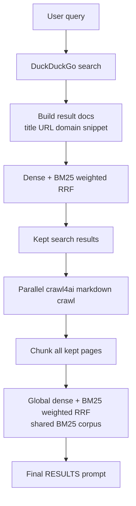

# TinySearch

<p align="center">
  
</p>

[](LICENSE)
[](https://github.com/MarcellM01/TinySearch/releases)
[](https://github.com/MarcellM01/TinySearch/commits/main)
[](https://modelcontextprotocol.io/)
[](https://fastapi.tiangolo.com/)

TinySearch is a tiny, local-first research engine for agents. It searches the
web, reranks results with dense embeddings plus BM25, crawls the best pages,
pulls out the most relevant chunks, and hands your LLM a source-grounded prompt
instead of a mystery-meat answer.

It is built for MCP, simple enough to run locally, and boring in the best way:
no hosted dashboard, no account system, no analytics, no scraped data cache.

## Why It Exists

- Give agents a compact web research tool they can call over MCP.
- Keep source URLs attached to every factual claim your LLM should make.
- Avoid dumping entire pages into context when a few ranked chunks will do.
- Let you swap between local ONNX embedding models and an OpenAI-compatible embedding API.

## What It Does

- Searches DuckDuckGo's HTML endpoint.
- Ranks search results with weighted reciprocal rank fusion over dense vectors and BM25.
- Crawls kept pages with Crawl4AI.
- Chunks and reranks page text globally, not one page at a time.
- Returns a `SEARCH-GROUNDED ANSWER PROMPT` for the caller's model to answer from.

## Entrypoints

- `pipelines.agentic_research.agentic_run`: single-turn search, crawl, ranking, and prompt assembly.
- `servers.mcp_server`: MCP server for agent clients.
- `servers.fastapi_server`: optional HTTP API.

## Install

```bash
python -m venv .venv
source .venv/bin/activate
pip install -r requirements.txt
```

On Windows PowerShell:

```powershell
python -m venv .venv
.\.venv\Scripts\Activate.ps1
pip install -r requirements.txt
```

The `onnx` embedding backend uses local ONNX bundles under `models/`. Starting the
MCP server or FastAPI app downloads the configured `embedding_model` once from Hugging
Face when `embedding_backend` is `onnx`.

Built-in local presets are `fast` (`onnx-models/all-MiniLM-L6-v2-onnx`),
`balanced` (`BAAI/bge-small-en-v1.5`), and `quality` (`BAAI/bge-base-en-v1.5`).
You can also set `embedding_model` to a custom Hugging Face ONNX repo id. Set
`TINYSEARCH_MODELS_DIR` to move the whole model cache, or use
`TINYSEARCH_ONNX_MODEL_DIR` only when you need to point at one exact bundle
directory.

## MCP Setup

Add TinySearch to your MCP client config. Use absolute paths.

macOS / Linux:

```json
{
  "mcpServers": {
    "tinysearch": {
      "command": "/absolute/path/to/TinySearch/.venv/bin/python",
      "args": [
        "/absolute/path/to/TinySearch/servers/mcp_server.py"
      ]
    }
  }
}
```

Windows:

```json
{
  "mcpServers": {
    "tinysearch": {
      "command": "C:/absolute/path/to/TinySearch/.venv/Scripts/python.exe",
      "args": [
        "C:/absolute/path/to/TinySearch/servers/mcp_server.py"
      ]
    }
  }
}
```

Docker with MCP over HTTP:

Docker is MCP-first. Released images are published as:

```text
marcellm01/tinysearch:<version>
marcellm01/tinysearch:latest
```

Start the published MCP image:

```bash
docker run --rm \
  -p 8000:8000 \
  -v tinysearch-models:/data/models \
  -v "$PWD/configs/research_config.json:/config/research_config.json:ro" \
  -e TINYSEARCH_CONFIG_PATH=/config/research_config.json \
  -e TINYSEARCH_MODELS_DIR=/data/models \
  -e MCP_TRANSPORT=streamable-http \
  -e MCP_HOST=0.0.0.0 \
  -e MCP_PORT=8000 \
  marcellm01/tinysearch:latest
```

Then point any MCP client that supports streamable HTTP at:

```text
http://localhost:8000/mcp
```

Example MCP client config:

```json
{
  "mcpServers": {
    "tinysearch": {
      "url": "http://localhost:8000/mcp"
    }
  }
}
```

Docker with MCP over stdio:

Use this mode for MCP clients that launch tools as local commands instead of
connecting to a URL. Add a Docker-backed command entry to your MCP client config. Replace
`/absolute/path/to/TinySearch` with this repo's absolute path:

```json
{
  "mcpServers": {
    "tinysearch": {
      "command": "docker",
      "args": [
        "run",
        "--rm",
        "-i",
        "-v",
        "tinysearch-models:/data/models",
        "-v",
        "/absolute/path/to/TinySearch/configs/research_config.json:/config/research_config.json:ro",
        "-e",
        "TINYSEARCH_CONFIG_PATH=/config/research_config.json",
        "-e",
        "TINYSEARCH_MODELS_DIR=/data/models",
        "marcellm01/tinysearch:latest"
      ]
    }
  }
}
```

Edit `configs/research_config.json` to choose `embedding_model` (`fast`,
`balanced`, `quality`, or a custom Hugging Face ONNX repo id). The named Docker
volume keeps downloaded model bundles between launches.

The MCP server exposes one tool:

```text
research(query)
```

Pass the user's question as-is. TinySearch does the search and returns a prompt
in `answer`; your client model should use that prompt to produce the final,
cited response.

Template config files live in `mcp_templates/`.

The repo also includes [`agentic_coding_templates/global-rules-recommended.md`](agentic_coding_templates/global-rules-recommended.md), a global-rules template we **strongly recommend** if you wire TinySearch into any agentic coding tool (Cline, Roo Code, and similar). With those rules in place, it works like a charm.

The server uses **stdio** by default (what Cursor and similar clients expect when
they spawn `python .../mcp_server.py`). To run with `sse` or `streamable-http`
instead, set environment variable `MCP_TRANSPORT` when starting the process; do
not put transport in `configs/research_config.json`.

## Optional HTTP Server

```bash
uvicorn servers.fastapi_server:app --reload
```

Useful endpoints:

- `GET /health`
- `GET /web_search?query=...`
- `POST /site_crawl`
- `POST /research`

## Research Flow



The returned `answer` is not a synthesized answer. It is a prompt containing
ranked source blocks:

```text
========================================================================================
SEARCH-GROUNDED ANSWER PROMPT
========================================================================================
QUESTION
========================================================================================
...
========================================================================================

TODAY
========================================================================================
2026-05-12
========================================================================================

CRITICAL INSTRUCTIONS
========================================================================================
You are answering a question using search results.
Use only the text under RESULTS.
If the answer is not directly supported, say the results are not enough.
Use TODAY to understand relative dates like today, yesterday, this year, or last month.
If the RESULTS text contains dates, use those dates when they matter.
Cite the source URL after each factual claim.
========================================================================================

========================================================================================
RESULTS
========================================================================================
========================================================================================
RESULT 1
========================================================================================
TITLE 1
======
...
======
URL 1
======
...
======
SEARCH PREVIEW 1
======
...
======
RELEVANT TEXT 1
======
----- RELEVANT CHUNK 1 -----
...
======

========================================================================================
QUESTION
========================================================================================
...
========================================================================================

TODAY
========================================================================================
2026-05-12
========================================================================================

SEARCH-GROUNDED ANSWER PROMPT
========================================================================================
```

## Configuration

Tune research defaults in `configs/research_config.json`. Set
`TINYSEARCH_CONFIG_PATH` to load a different JSON config file, which is the
recommended Docker override pattern.

- Search: `search_top_k`, `search_rrf_cutoff`, `search_dense_weight`, `search_max_results_to_keep`
- Chunks: `chunk_rrf_cutoff`, `chunk_dense_weight`, `chunk_max_results_to_keep` (default `2`, global across the chunk pool)
- Crawl: `crawl_max_chunk_tokens` (default `300`, counted with the embedding model tokenizer), `crawl_overlap_tokens`, `max_concurrent_crawls`
- Embeddings: `embedding_backend` (`onnx` = local ONNX bundle, `openai_compatible` = API; legacy `default` still aliases to `onnx`), `embedding_model` (`fast`, `balanced`, `quality`, or a custom Hugging Face ONNX repo id), `embedding_openai_env_file` (path to `.env` for API URL, key, and model when using `openai_compatible`), `max_concurrent_embedding_calls`; optional `TINYSEARCH_MODELS_DIR` for the model cache root, or `TINYSEARCH_ONNX_MODEL_DIR` for an exact expert bundle path override
- Tokenizer: `encoding_name` defaults to `embedding`, which means chunk budgets use the tokenizer for the configured embedding backend. Set it to a specific tiktoken encoding or local tokenizer path only when you intentionally want a different counter.
- Dense input prefixes: `dense_query_prefix`, `dense_document_prefix`
- Trace: `trace_path`

For `embedding_backend` `openai_compatible`, add a `.env` file at the project root (or set `embedding_openai_env_file`) with `OPENAI_BASE_URL` (optional for api.openai.com), `OPENAI_API_KEY`, and `OPENAI_EMBEDDING_MODEL` (aliases: `EMBEDDING_MODEL`, `MODEL_NAME`).

The research pipeline requires dense embeddings. It raises if
`search_dense_weight` or `chunk_dense_weight` is set to `0`.

Edit `dense_query_prefix` and `dense_document_prefix` if a different embedding
model expects raw text or a different instruction format.

## Tests

Run the unittest suite:

```bash
python -m unittest discover tests
```

## License

Source code in this repository is under the [MIT License](LICENSE).

When `embedding_backend` is `onnx`, TinySearch may download the selected local ONNX
embedding bundle at runtime from Hugging Face. Those weights are separate distributions
under their model-card licenses; keep license and attribution notices if you ship or
redistribute those files. Optional manual export for `fast` uses
`sentence-transformers/all-MiniLM-L6-v2` (Apache-2.0).

See [NOTICE](NOTICE) for Docker and third-party distribution notes.

## Privacy Notes

TinySearch reads the pages it crawls and returns ranked excerpts to the calling
client. It does not include credentials in the repo, and `.env` / trace output
should stay local. If you enable `openai_compatible` embeddings, your embedding
provider receives the text snippets sent for vectorization.
